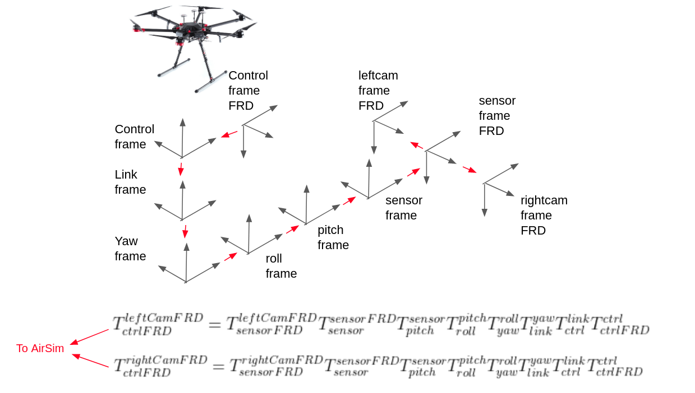
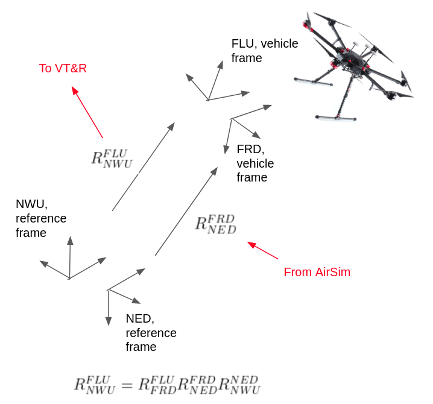

# AirSim Stereo Gimbal

This document illustrates the details of the custom stereo gimbal implementation in AirSim. The gimbal is implemented in `airsim_gimbal_controller.py` in `airsim_vtr_interface` package.

## Overview

The AirSim stereo gimbal controller simulates the [ronin-mx gimbal](https://www.dji.com/ca/ronin-mx) used by the DJI M600, to which the [ZED stereo camera](https://www.stereolabs.com/zed/) is mounted. The controller outputs the left and right stereo camera poses to AirSim. The current implementation simulates constant speed motion in the roll, pitch and yaw directions, the speed of motion can be set using the ros parameter `/airsim_gimbal_controller/gimbal_angle_speed` in `airsim_interface.launch`. 

All the reference frames and joints for the gimbal were retrieved from `m600_urdf.xml` file, located in the `asrl__dji` package. 

The `airsim_gimbal_controller.py` publishes the topics required by `ronin_gimbal.cpp` to run the VT&R gimbal controller. 

The topics published are as follows:

* `/dji_sdk/gimbal_angle` gimbal joint angles
* `/dji_sdk/attitude` M600 attitude

It also subscribes to the `/dji_sdk/gimbal_angle_cmd` topic in order to receive gimbal joint commands.

Below are some supplementary diagrams to help in understanding the code in `airsim_gimbal_controller.py`. 

## Gimbal Frames

 

The above diagram illustrates the calculation of the left and right camera poses relative to the drone's control frame. These poses are sent directly to airsim. The implementation of this step is completed in `gimbal_controller` function.

## Drone Attitude Frames

The above diagram illustrates the calculation of the vehicle's attitude. The attitude received from airsim is of the vehicle's FRD frame relative to the NED frame of reference, that is converted to the attitude of the vehicle's FLU frame relative to the NWU frame. 

